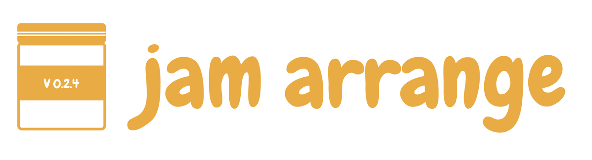

 

jamarrange accurately combs through all your file metadata and uses it to accurately arrange your music.

Organise, declutter, and sort through all your favourite jams with the power of audio fingerprinting (comming soon).

# Contents

- [Getting started](#getting-started)
- [Downloads](#downloads)
- [Contribution](#contribution)

---
## Getting started
jamarrange is built on python 2.7 More specifically 2.7.12. It should work fairly well for most python 2 builds, but has not been tested on these as yet.

##### Clone and begin
Clone the latest stable release of the master project into your dev directory and start working.

```
$ git clone git@github.com:numstack/jamarrange.git
```

##### WXpython
jamarrange utilises WXpython for it's GUI capabilities and functionalities. To develop using WXpython modules, simply download and setup WXpython for mac as instructed for your machine and the specific python version you are running on the [following link](https://www.wxpython.org/download.php).

##### Tinytag
jamarrange relies on the Tinytag plugin to handle media file metadata. The installation details for setting up and installing TinyTag on python 2 can be found on the [following link](https://pypi.python.org/pypi/tinytag/) or by installing it through pip install, as illustrated below:

```
pip install tinytag
```

Tiny tag is a library that allows you to access file meta data (mainly audio files within jamarrange). It supports:
- MP3
- OGG
- OPUS
- MP4
- M4A
- FLAC
- WMA
- Wave files

To begin (once installed). Simply import your library and use the TinyTag.get() function to get all the metadata contained within a desired file. Use the file local directory as a string input as illustrated below.

```
from tinytag import TinyTag
tag = TinyTag.get('/some_folder/favourite_song.mp3')
print('This track is by %s.' % tag.artist)
print('It is %f seconds long.' % tag.duration)
```

Listed below is a list of possible attributes you can get with TinyTag:

```
tag.album         # album as string
tag.albumartist   # album artist as string
tag.artist        # artist name as string
tag.audio_offset  # number of bytes before audio data begins
tag.bitrate       # bitrate in kBits/s
tag.disc          # disc number
tag.disc_total    # the total number of discs
tag.duration      # duration of the song in seconds
tag.filesize      # file size in bytes
tag.genre         # genre as string
tag.samplerate    # samples per second
tag.title         # title of the song
tag.track         # track number as string
tag.track_total   # total number of tracks as string
tag.year          # year or data as string

```

To access file cover images from ID3 tags you can follow the example below:

```
tag = TinyTag.get('/some/music.mp3', image=True)
image_data = tag.get_image()
```

## Downloads
Currently jamarrange version 0.2.4 is available as a jamarrange.app file for Mac users. To download and try the free app [click here](http://www.numstack.co.za/demos/jamarrange/jamarrange.app.zip).

## Contribution
Want to contribute? Simply fork the latest master repository (stable release and version).
